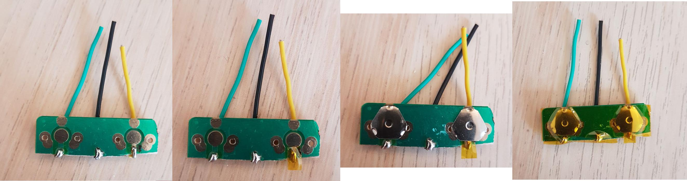
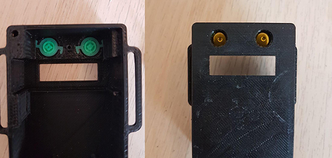
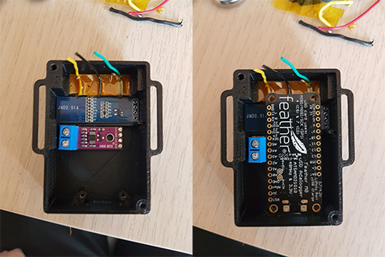
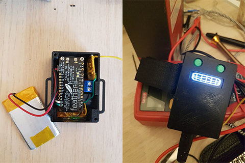

# Assembly

To start the assembly, you will most likely need:

- The instrument case
- The main board (Feather M0/32u)
- Buttons board
- Thermocouple board
- Spark plug sensor board
- Battery
- Screen

There really isn't so much space in the case, so I made these instructions to show how I assembled the instrument.

# Buttons
For the buttons, I chose to go for a cheaper, more reliable, more customizable way. This is however a little more tricky.
You need some of [these](https://www.aliexpress.com/item/32668884101.html).

You can use 2x steel tactile dome switches (triangular 6mm, 2 leg such as ), and a pcb. A piece of perfboard should also work.

The board size is 30mm x 9mm, with buttons distanced 18mm and centered on the board. If you are using perfboard, the switch leg holes will not be centered vertically, but will be 5mm/4mm away from the top and bottom edge.

Isolate the connections coming from the central pad with PCB enamel or a little bit of kapton tape, otherwise the buttons will be shorted all the time.

Connect very thin wires to close-by pads, use very little solder so the connection is as thin as possible and fits under the button. Use a solder wick to help out getting a thin layer.
Then, from such near-by pads, get thicker wires to go to the back of the board.

The dome switch feet need to be grounded, while the central pad goes to the input pin.

Covering the buttons with tape helps keep them in place.

In the end, you get one wire per button plus the ground.

# Spark plug sensor
The spark plug input circuit works by capacitive coupling a pigtail wire to the spark plug cable. The spark plug cable itself will reach pretty high negative voltages, in the 10kV range. This in turn causes a positive voltage spike in the pigtail wire. The circuit is designed with an input low pass filter, so the spike does not reach dangerous values, and right after this, a high pass filter that is more meant as a protection than a filter. Then, there are two diodes for input protection against overvoltages and undervoltages for a transistor, which generates a ~20us low-logic pulse every time a spark happens.

In general, 5-6 wraps should be sufficient. Use the smallest number of wraps that will give a consistent reading. Too many wraps can cause issues with ignition and may damage the board.

You can make the circuit on perf board, using smd components.

Remember to wrap the whole sensor in isolating tape, it is probably not a good idea to have shorts with other parts of the instrument.

# Fitting all the parts

Start by placing the 3d printed butting in their niches. Then, insert the button board in the retaining shelf. this is a pretty tight fit, so be patient and get it to align well.

The screen is small and quite delicate. Be careful when assembling. Should probably design a better retaining niche.

The micro SD card quality is quite important. When not in use, larger, faster SD cards will use up a lot of battery. Try to find cheap, slow ones. [These](https://www.ebay.it/itm/303426113204?ssPageName=STRK%3AMEBIDX%3AIT&_trksid=p2060353.m2749.l2649) 4Gb cards use 200uA when in standby.

Isolate the SD card slot with some tape. This can cause shorts with the underlying boards.

After this, try fitting the feather board. This will give you a good idea of where the connection wires should be. Try to keep this arrangement while soldering all the connections.

The battery I had lying around was a 1000mAh 60x40mmx5mm battery (504060 battery format). This was pretty old, now you can either find the same capacity with a smaller size, or up to 1800mAh for the same format. Probably a smaller battery will fit nicely.

The fastening strap is mixed hook&loop, which means it sticks to itself. I found this pretty convenient, and pretty safe.

