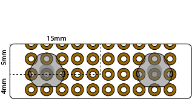

# Assembly

To start the assembly, oyu will most likely need:

- The instrument case
- The main board (Feather M0/32u)
- Buttons board
- Thermocouple board
- Spark plug sensor board
- Battery
- Screen

There really isn't so much space in the case, so I made these instructions to show how I assembled the instrument.

# Buttons
This part is a little bit artisanal.
The first thing you will need is the Buttons board, since this is placed pretty deep into the assembly.
To build it, you can use 2x steel tactile dome switches (triangular 6mm, 2 leg such as [these](https://www.aliexpress.com/item/32668884101.html)), and a pcb. A piece of perfboard should also work.

The board size is 30mm x 9mm, with buttons distanced 18mm and centered on the board. If you are using perfboard, the switch leg holes will not be centered, but will be 5mm/4mm away from the top and bottom edge.

Isolate the connections coming from the central pad with PCB enamel or a little bit of kapton tape, otherwise the buttons will be shorted all the time.

Connect very thin wires to close-by pads, use very little solder so the connection is as thin as possible and fits under the button. Use a solder wick to help out getting a thin layer.

From such near-by pads, get thicker wires to go to the back of the board.

the feet need to be grounded, while the central pad goes to the input pin.

Covering the buttons with tape helps keep them in place.

In the end, you get one wire per button plus the ground.

